# From Epochs to Forevers. Introducing RegenStaker.

*Draft v1 — Feb 12, 2026*
*Status: Text complete, diagrams pending*

---

If you've been staking GLM on Octant, you know the rhythm. Lock your tokens. Wait for the epoch to end. Allocate to projects. Collect your ETH rewards. Rinse and repeat, every 90 days or so.

That rhythm served us well through 10 epochs. But we've been listening to our community. And we heard the same thing over and over again.

"Why can't I just... stake when I'm ready?"

Fair question. Let's get into it.

## How epochs work today

Here's a quick crash course on the current model.

An epoch is a fixed staking cycle that lasts roughly 90 days. You lock GLM into the v1 contract at any point during the epoch. When the epoch ends, an allocation window opens. During that window, you decide which projects get a share of the rewards pool. Then the cycle resets and a new epoch begins.

Your rewards depend on how much GLM you locked and for how long within that epoch. Everyone operates on the same clock. Same start, same end, same allocation window.

Straightforward. Predictable.

But predictable comes with trade-offs.

## Where it breaks down

Lock your GLM on day 45? You've committed capital, but you're earning roughly half of what someone who locked on day one gets. The clock doesn't wait for you.

Forget to allocate during the window because life happened? Your rewards default to the matching fund. Not the projects you wanted to support. And then you wait another 90 days.

Want to unstake early because you need liquidity? You can, but you're walking away from that epoch's rewards entirely.

Your tokens are locked. Your options aren't flexible.

We kept hearing from users: "I believe in Octant. I want to stake. But I don't want to plan my life around a 90-day calendar."

So we built something different.

## Enter RegenStaker

RegenStaker throws out the calendar.

Stake your GLM whenever you want. Unstake whenever you want. Earn rewards the entire time your tokens are in the contract. No epochs. No windows. No deadlines.

Think of it this way. Epochs were a bus schedule. The bus leaves every 90 days whether you're on it or not. RegenStaker is more like a taxi. It's there when you need it, runs on your schedule, and you get out when you're done.

Your rewards are time-weighted. The longer your GLM stays staked, the more you earn. Proportionally, continuously, with no gaps between cycles.

Your GLM doesn't take vacations. Why should your rewards?

## How it works

Let's break down the mechanics.

**Staking and rewards**

You deposit GLM (Golem Network Token) into the RegenStaker contract. In return, you start accumulating WETH rewards. Why WETH instead of regular ETH? The reward mechanism requires an ERC-20 token for streaming, and WETH is ETH's ERC-20 wrapper. Same value, just compatible with the contract logic.

Rewards are distributed linearly over 30-day cycles. Every time new WETH enters the reward pool, it gets streamed to stakers over the next 2,592,000 seconds (that's exactly 30 days). Your share is proportional to your earning power relative to everyone else in the pool.

There's no minimum stake. Zero GLM floor. You can start with whatever amount makes sense for you.

**Earning power**

Your earning power determines your share of the reward pool. Right now, the calculation is simple: 1 GLM staked equals 1 unit of earning power. Linear, no multipliers, no tricks.

But there's an access layer on top. The Earning Power Calculator checks whether your address passes the current access rules. Three modes exist:

- Open: everyone earns. No restrictions.
- Allowlist: only approved addresses earn rewards.
- Blocklist: everyone earns except blocked addresses.

If your address doesn't pass the check, your earning power drops to zero. You can still stake, but you won't accumulate rewards until the access issue is resolved.

**Choosing where rewards go**

When you stake, you pick an allocation mechanism from a whitelist of approved options. This is where your generated rewards flow. Think of it as choosing which funding stream your capital supports.

The allocation mechanism whitelist is managed by the multisig. Only approved mechanisms can receive staker contributions. This keeps the system flexible for adding new funding channels later without requiring a new contract deployment.

## Under the hood

For those who want to peek behind the curtain, here's how the contracts are structured.

RegenStaker isn't a single contract. It's five components working together.

**AddressSet Factory** creates the whitelist and blocklist contracts that control who can stake and which allocation mechanisms are approved. Deployed once, used to spin up multiple permission lists.

**Three AddressSets** come out of that factory. One allowlist for stakers, one blocklist for stakers, and one allowlist for allocation mechanisms. All three are owned by the Safe multisig. Only the multisig can add or remove addresses.

**Earning Power Calculator** sits between your stake and your rewards. It checks your address against the current access mode, then converts your staked GLM into earning power. Right now that conversion is 1:1. The multisig can update access rules after deployment, but the math stays transparent.

**RegenStaker Factory** deploys the staking contracts themselves. It stores canonical bytecode hashes and rejects any deployment with modified code. Think of it as a factory with a quality inspector built in. If someone tries to deploy a tampered version of the contract, the factory says no.

**RegenStaker Contract** is where your GLM actually lives. This variant runs without delegation, meaning your staked GLM doesn't participate in governance voting. You stake, you earn WETH, you unstake. Clean and simple.

The entire system runs under a Safe multisig. No single wallet can pause the contract, change parameters, or modify access rules alone. Multiple signers, multiple approvals. That's the security model.

`[DIAGRAM: Component architecture — 5 boxes with arrows showing Factory → AddressSets → Calculator → StakerFactory → RegenStaker Contract, multisig as admin overlay]`

## Migrating from v1 to v2

Already staking on v1? Moving over takes three on-chain transactions. That's it.

**Step 1:** Unlock your GLM from the v1 contract.

**Step 2:** Approve the token allowance for the v2 RegenStaker contract.

**Step 3:** Lock your GLM into v2.

Your wallet will prompt you to confirm each transaction one after another. Each one may take a moment to confirm on-chain. Don't close the migration modal until all three steps complete.

One important detail: if you've already deposited into v2 separately, the migration won't create a duplicate position. It calls "stake more" on your existing deposit and increases your balance. One address, one position, always.

Rewards are time-weighted from the moment you migrate. The earlier you move, the longer you're staked, the more you earn. Waiting costs you.

`[DIAGRAM: 3-step migration flow — v1 Contract → (1. Unlock) → GLM in wallet → (2. Approve) → Allowance set → (3. Lock) → v2 RegenStaker. "Rewards start streaming immediately"]`

## Why this matters

Octant has always been about making capital work for the ecosystem without asking users to sacrifice their principal. Vaults preserve your deposit. Yield flows to builders and contributors.

RegenStaker extends that same idea to staking.

Your GLM is yours. Stake it when you have conviction. Pull it out when you need liquidity. Earn rewards every second it's in the contract. Direct those rewards to the allocation mechanisms you believe in.

No 90-day countdown. No missed windows. No anxiety about timing.

Just continuous participation, on your terms.

`[DIAGRAM: Side-by-side — Left: v1 epoch cycle (Lock → Wait 90d → Allocate → Rewards → Repeat) as rigid blocks. Right: v2 continuous (Stake anytime → Rewards stream → Unstake anytime) as flowing line]`

## Ready to make the switch?

RegenStaker is live. If you're currently staked on v1, head over to [glm.octant.app] to migrate. Three transactions, a few minutes, and you're earning on your own schedule.

Questions? Come find us on [Discord](https://discord.gg/octant) or [reach out on X](https://x.com/OctantApp).

From epochs to forevers. Welcome to RegenStaker.

---

## Diagram Specs

### Mermaid.js Code

**Diagram 1: v1 vs v2**

**Diagram 2: Architecture**

```mermaid
graph TD
    MS[🔐 Safe Multisig - Admin] -.-> ASF
    MS -.-> EPC
    MS -.-> RSF
    MS -.-> RS
    ASF[AddressSet Factory] --> AL[Staker Allowlist]
    ASF --> BL[Staker Blocklist]
    ASF --> AML[Allocation Mechanism Allowlist]
    AL --> EPC[Earning Power Calculator]
    BL --> EPC
    RSF[RegenStaker Factory] -->|bytecode validation| RS[RegenStaker Contract]
    EPC --> RS
    AML --> RS
    GLM[GLM In] --> RS
    RS --> WETH[WETH Streaming Out]
```

**Diagram 3: Migration**

```mermaid
graph LR
    V1[v1 Contract] -->|1. Unlock GLM| W[GLM in Wallet]
    W -->|2. Approve Allowance| A[Allowance Set]
    A -->|3. Lock into v2| V2[RegenStaker v2]
    V2 --> R[✅ Rewards Start Streaming]
```

### Eraser.io Prompts

**Diagram 1:** Side-by-side comparison of two staking models. Left side labeled "Octant v1 (Epochs)": circular flow Lock GLM → Wait 90 days → Allocation Window → Receive ETH Rewards → Repeat. Rigid blocky boxes. Right side labeled "Octant v2 (RegenStaker)": continuous flowing line Stake GLM anytime → WETH rewards stream continuously → Unstake anytime. Colors: dark #171717, cream #FEFDF4, orange #FF9602.

**Diagram 2:** Architecture diagram, 5 components. Top: Safe Multisig (Admin) with dotted lines to everything. AddressSet Factory → 3 AddressSets (Staker Allowlist, Staker Blocklist, Allocation Mechanism Allowlist). Earning Power Calculator connects to AddressSets and RegenStaker Contract. RegenStaker Factory deploys RegenStaker Contract with "bytecode validation" label. Bottom: GLM goes in, WETH streams out.

**Diagram 3:** Horizontal 3-step flow. Step 1: Unlock GLM from v1 (lock opening icon). Step 2: Approve token allowance (checkmark). Step 3: Lock into RegenStaker v2 (lock closing). Below step 3: "Rewards start streaming immediately". Note: increases existing position if one exists.
